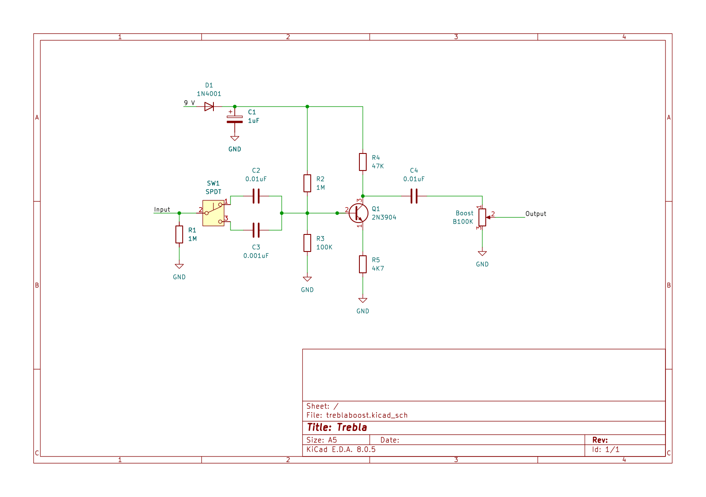
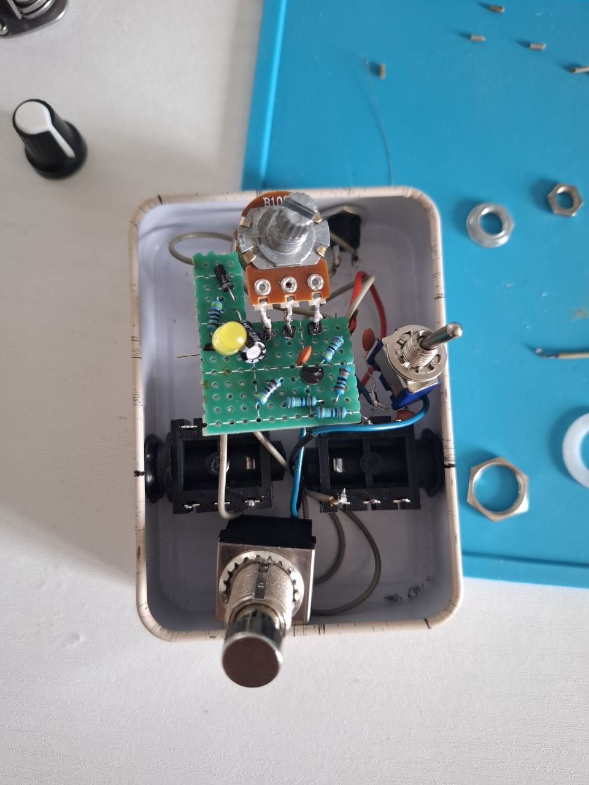
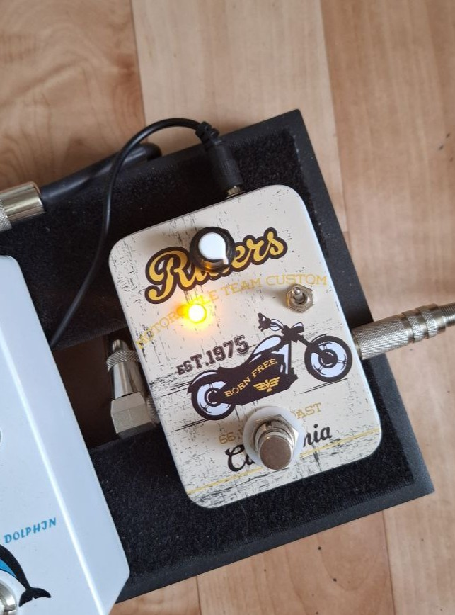

# guitar-booster
Another look on EHX LPB-1 booster
This is my custom-designed booster pedal for electric guitar. It adds clean gain with slight tone changes — great for solos or pushing an amp harder.

## Features
- Solo and clean boost
- 2 modes for boosting

## Schematic

## Parts Used
| Component | Value |
|----------|-------|
| Transistor   | 2N3904 |
| Resistors | See schematic |
| Capacitors | See schematic |
| Power | 9V DC |

## Build Process
1. The original schematic of LPB-1 was learnt and used as a beginning reference.
   LPB-1 is a simple common emitter transistor amplifier with gain of approximately 25 dB without distorting the signal(clean boost).
   
    
   My goal was essentially to try this topology with another transistor - 2N3904. According to datasheets comparison, the original 2N5088 transistor has much greater possible gain, which is almost 3 times higher than of 2N3904.
   
   I had no 2N5088 to compare 2 transistors directly, however the audio tests made by other people show the difference in output volume which 2 transistors have. Obviously, it is better to use transistor with higher gain in order to achieve better results, but I still wanted to try to build this pedal.
   

3. The circuit was built on DIY test stand for easier pedal tests. It is simply a breadboard which is connected to a true-bypass circuit with easy connection to guitar and an amplifier.
   After building this topology I realized that 2N3904 is easily distorted and needed to be properly biased in order to get the cleanest sound as possible. To achieve this, the LTSpice simulation was used in order to identify the values for biasing which will result in the least distorted output. It was considered that resistors values should be the ones of my possession. After some time the values of Rc=47k and Re=4k7 were chosen.

4. Because of relatively small gain of the transistor, it was decided to move from boosting overall volume concept to boosting particular frequency, that can be useful in lead sections of guitar playing to make solo or lead parts sound better in the mix. Therefore the option of choosing input capacitor, which is essentially the high-pass filter, was cosidered. The test showed that value of 0.01uF sound good for general boosting and 0.001uF for solo boosting, as higher frequency cut better from the mix even on high-gain distorted ampllifiers.

5. The next step was building the pedal. Since it is relatively small project, the enclosure was chosen to be a small metal box. The layout was created on perf board and then wired to have true bypass 3PDT as well as SPDT switch was added to switch input capacitors.
   

Final tests with other pedals like overdrive and distortion showed the boost of gain, which alters a sound a little bit, making it more compressed and making it easier to play single notes. However, there is no headroom, as it works well only when the boost potentiometer is maxed, which is obvious as by specifications, 3904 gives almost 3 times less possible gain than 5088. 

Therefore I will consider changing the transistor on 5088 as soon as I will get the opportunity.

In addition, the 1uF cap was changed by 100uF cap after some research, as it works better for power noise filtering in pedals.

## License
MIT License — free to use for personal/non-commercial projects.
---

© 2025 Daniil Khichshenko
